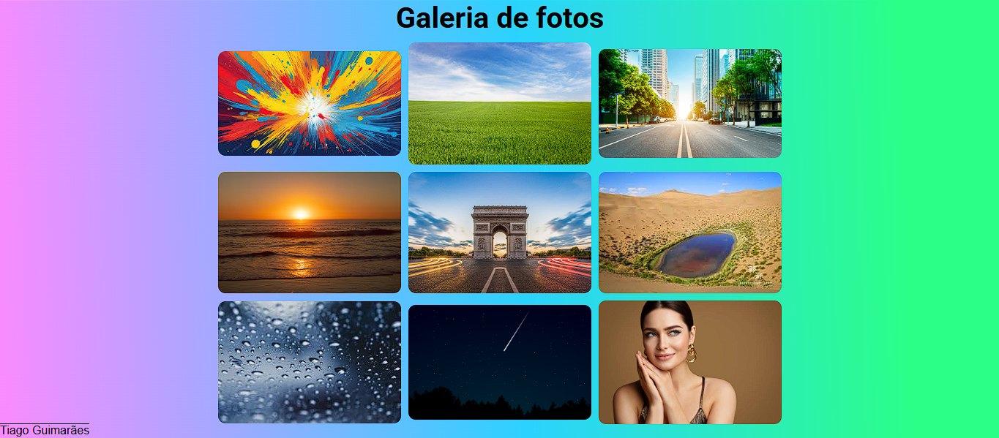

# Galeria 3 x 3

## Descrição

Página de uso de uma galeria de imagens simples (3 x 3).

## Tecnologias Utilizadas

- **HTML** para a estrutura da página.
- **CSS** para o estilo visual.

## Estrutura de Arquivos

- `index.html`: A página HTML com a receita.
- `style.css`: Arquivo de estilo para dar aquele visual todo especial.
